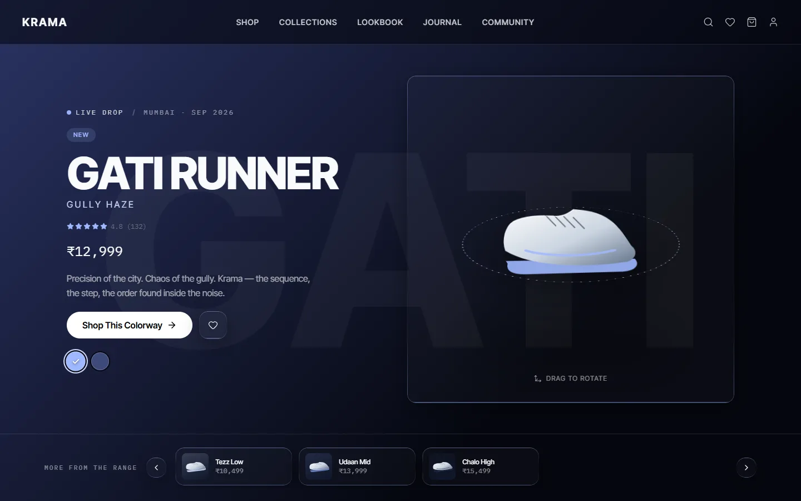
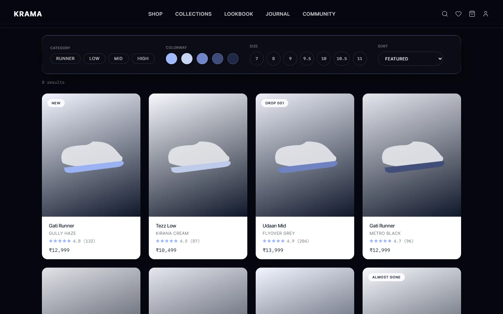
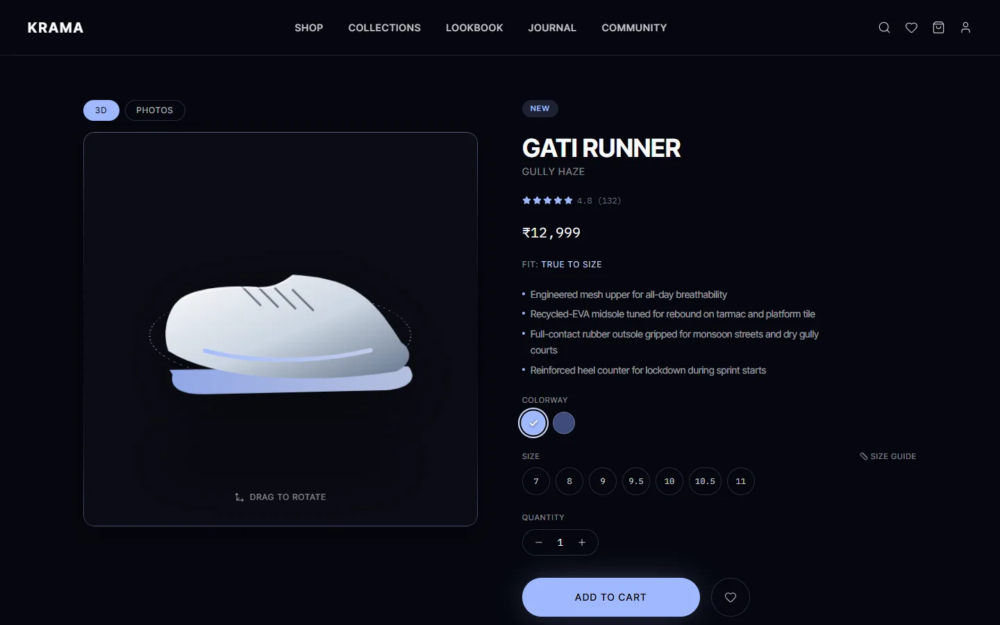
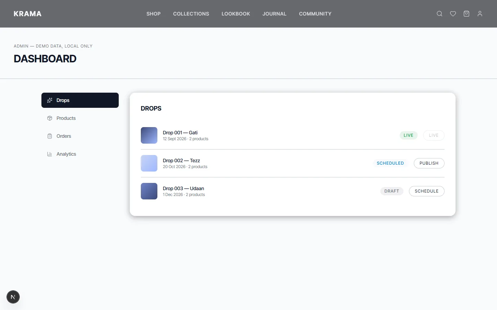
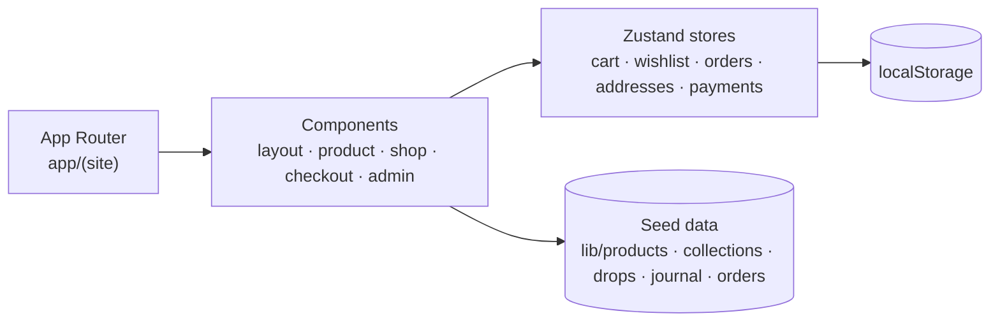

<div align="center">



<br />

     

<br />

**[Run it](#run-it)** &nbsp;·&nbsp; **[Features](#features)** &nbsp;·&nbsp; **[Architecture](#architecture)** &nbsp;·&nbsp; **[Installation](#installation)** &nbsp;·&nbsp; **[Limitations](#limitations)**

</div>

---

<p align="center">
  
</p>

Krama is a sneaker storefront designed like a fashion editorial rather than a product grid. Drops are announced like events, product pages lead with a sneaker you can rotate, and the rest of the site (lookbook, journal, community) is there to give the shoes a world to live in.

It is a complete storefront front end with no backend: shop and filters, product pages, a cart drawer, a multi-step checkout, a customer account, and an admin console for drops, products and orders. All data is local seed data and browser storage, so it runs with no services or keys.

## Run it

```bash
git clone https://github.com/Samudra-GITHub/Krama.git
cd Krama && npm install && npm run dev
```

Then open <http://localhost:3000>. Pick a size on any product and add it to the cart.

## Features

<table>
  <tr>
    <td width="50%" valign="top">
      
      <h3>A shop you can filter</h3>
      <p>Category, colourway and size filters with sorting, and a card grid with drop and low-stock tags. Prices are in Indian rupees (₹).</p>
    </td>
    <td width="50%" valign="top">
      
      <h3>Product pages with a viewport</h3>
      <p>A drag-to-rotate viewport next to a photos tab, colourways, size chips, a size guide, ratings and related products.</p>
    </td>
  </tr>
  <tr>
    <td width="50%" valign="top">
      
      <h3>Cart, wishlist and checkout</h3>
      <p>A cart drawer, a wishlist and a search overlay, then a multi-step checkout with address and payment-method stores. Everything persists in the browser.</p>
    </td>
    <td width="50%" valign="top">
      
      <h3>An admin console</h3>
      <p>Manage drops (Draft, Scheduled, Live), products and orders, with simple analytics. It edits an in-memory copy of the seed data and is labelled "demo data, local only".</p>
    </td>
  </tr>
</table>

**Also:** a customer account area (orders, addresses, payment methods); editorial lookbook, journal and community pages; GSAP and Motion animation with Lenis smooth scrolling and magnetic buttons; a reduced-motion hook and a focus-trap hook for modals and drawers; a generated sitemap and robots file.

## Tech stack

| Layer | Technology |
| :-- | :-- |
| Framework | Next.js 16 (App Router), React 19, TypeScript 5 |
| Styling | Tailwind CSS 4 |
| Motion | GSAP with `@gsap/react`, Motion, Lenis |
| State | Zustand with `persist` |
| Icons and tooling | Lucide, ESLint 9 |

## Architecture



Content pages (home, collections, journal, product detail) are server components over seed data. Interactive pages (shop, checkout, account, admin, lookbook, community) are client components. Persistent state lives in small Zustand stores that write to `localStorage`.

```text
Krama/
├── app/(site)/     shop, product/[slug], collections, checkout, account, admin,
│                   lookbook, journal/[slug], community
├── components/     layout, product, shop, checkout, account, admin, motion, ui, 3d
├── lib/            seed data, store/ (Zustand), gsap.ts, useReducedMotion.ts, useFocusTrap.ts
├── scripts/        stop-dev.ps1 (Windows helper)
├── docs/           screenshots
└── Makefile
```

## Installation

Requires Node.js and npm.

```bash
npm install
```

| Command | What it does |
| :-- | :-- |
| `npm run dev` | Start the dev server on port 3000 |
| `npm run build` | Production build |
| `npm run start` | Serve the production build |
| `npm run lint` | Run ESLint |
| `make start` / `make stop` | Install and run the dev server, or stop it (`stop` uses PowerShell) |

### Environment

None needed. Products, collections, drops, journal entries and seed orders live in `lib/`.

### Deploy

No deployment configuration is included. It is a standard Next.js app (`npm run build`, then `npm run start`).

## Limitations

- **Payments are not real.** The payment store holds seeded card details only; there is no provider.
- **The sneaker is a placeholder illustration.** `components/3d/SneakerViewer.tsx` is a 3D-style drag and rotate viewport, written so a Spline scene can be swapped in later.
- No live inventory or orders backend.

## License

[MIT](LICENSE).
